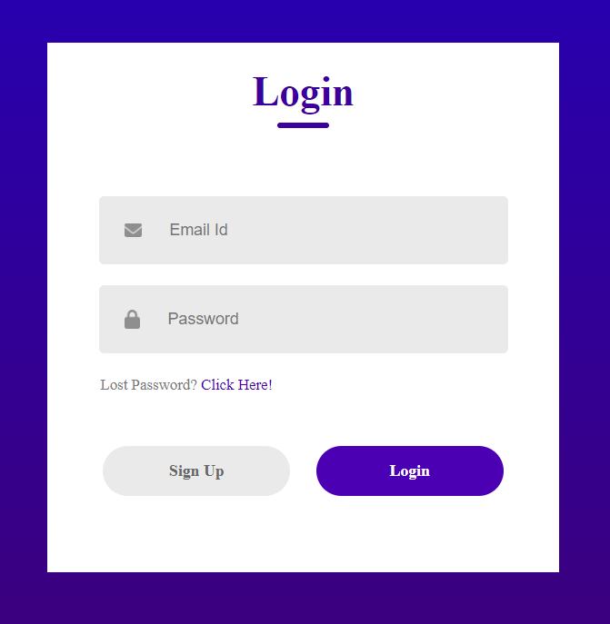

# React Sign-Up Component 🚀

This project includes a sign-up component created using React. It allows users to perform login and registration operations.

## Technologies Used 💻
- **React**
- **CSS**

## Component Structure 📁
The project includes a main component named  `LoginSignup` This component manages the user's login and registration processes.

## Component Content 🎨
- Ability to switch between login and sign-up modes.
- Input fields for the username, email, and password.
- Input fields supported by visual icons.
- Password reset link (visible only in login mode).
- Buttons to easily switch between modes.

## Node Module Installation 📦
Open the terminal in the project directory and run the following command to install the necessary Node modules:

```bash
npm install
```

## Usage 🌐
1. Navigate to the project directory.
2. Open the terminal and start the project by running the following command:

```bash
npm start
```

3. Visit http://localhost:3000 in your browser to view and interact with the component.



## Live Demo 🌐
Live Demo: [SignUp Form Demo](https://signup-form-eight-mu.vercel.app/)

## Contributing 🤝
Feel free to use, modify, and contribute to the project! If you have any questions or feedback, you can reach me at your nisagokdemir@gmail.com

## License
This project is licensed under the **MIT License**.

